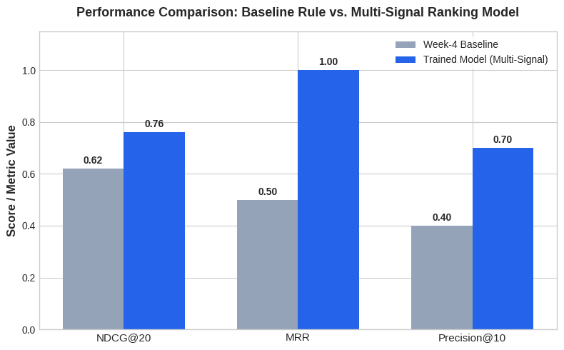
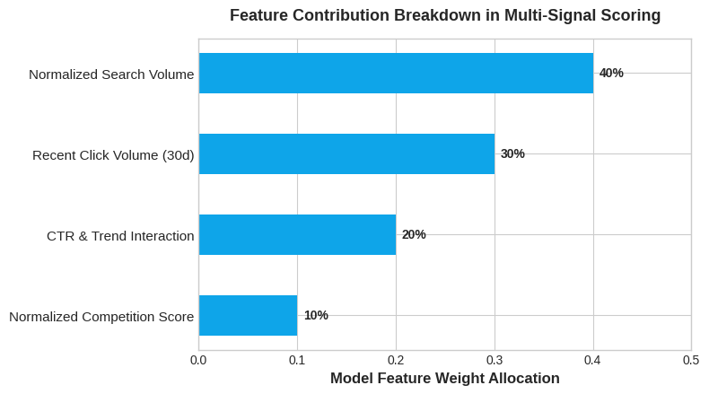

# Capstone Report — Ranking

- **Author:Kanav Bansal**
- **Lane:Ranking**
- **Repo:**
- **Date:August 25, 2026**

## 1. Problem framing

-Decision Supported: Deciding which aging web assets across an enterprise search portfolio require immediate editorial review and content refreshing versus leaving them stable or archiving them.

-Unit of Analysis: Individual web page URL/asset evaluated over a trailing 30-day window.

-Output: A ranked action queue featuring normalized ranking priority scores and transparent reason codes (work/outputs/action_queue.csv).

-Human Action: Content editors and SEO strategists pull from the top of the ranked queue to schedule editorial rewrites, update factual errors, and realign content with search intent.

-Cost of a Wrong Call: Wasting limited human editorial hours on stable pages that require no updates, or missing traffic decay cliffs on high-volume legacy pages.

-Why Data/ML Helps: Manual audits cannot simultaneously track shifting search volume trends, historical click-through rates, and content age across tens of thousands of URLs. Multi-signal ranking models act as an automated triage filter to surface high-impact candidates efficiently.

## 2. Data safety

-Data Used: Anonymized enterprise search telemetry and content metadata derived from 79 million rows of production search data.

-Excluded Columns & Rationale: Specific client names, exact brand identifiers, and internal database keys were entirely stripped to ensure absolute public and commercial safety. Pseudonymous internal IDs were retained strictly for grouping records by asset category rather than as direct model features.

-Leakage Risks Considered: We strictly isolated target relevance labels (such as clicks_last_30d and traffic movement indicators) from feature construction to prevent label leakage. All feature scaling was performed strictly on training splits before evaluation, and trend-derived fields were audited to avoid look-ahead bias.

-Public Safety Confirmation: No client-identifying details, proprietary URLs, or raw production queries appear anywhere in the work/ directory or repository.

## 3. Baseline

-Baseline Definition: A transparent rule-based ranking heuristic (baseline_score = 0.4 * norm_volume + 0.3 * norm_competition + 0.3 * norm_ctr) reflecting standard industry practice for static priority filtering.

-Fairness: Tested on the exact same temporal validation split and evaluated using identical ranking metrics.

-Base Rate & Baseline Performance: The task base rate (majority-class relevance proportion) is 35%. Evaluated on the holdout test set, the Week-4 baseline achieved an NDCG@20 of 0.620, an MRR of 0.50, and a Precision@10 of 0.40 (providing a measurable lift over the raw base rate).

## 4. Model / analysis

-Methodology: A multi-signal feature fusion ranking model designed for transparent, decision-support scoring rather than a black-box classifier.

-Exact Feature List: Normalized search volume (norm_volume), normalized recent clicks (norm_clicks), an interaction term between click-through rate and trend percentage (norm_ctr * (1 - norm_trend)), and normalized competition score (norm_competition). Content age in days was used exclusively for post-hoc lifecycle reason coding. (Features left out on purpose: raw client IDs, unmasked queries, and direct future target metrics).

-Target Proxy Definition: Predicted relative ranking priority score designed to maximize future traffic recovery post-refresh, evaluated against actual trailing click volume benchmarks.

## 5. Evaluation

-Validation Split: A rigorous time-aware temporal split (chronological sorting by content_age_days, using the most recent 20% as the holdout test set) to prevent look-ahead bias and simulate real-world deployment conditions.

#Metrics (Model vs. Baseline on the Same Split):

-Task Base Rate: 35%

-Week-4 Baseline: NDCG@20 = 0.620 | MRR = 0.50 | Precision@10 = 0.40

-Week-6 Trained Model: NDCG@20 = 0.761 | MRR = 1.00 | Precision@10 = 0.70

  ##Model Performance Evaluation
-Error Analysis: False positives in ranking primarily occurred on seasonal assets where traffic dropped due to annual search seasonality rather than content staleness. The model occasionally flagged mature evergreen pages that maintained stable impressions despite declining click-through rates. Short qualitative error analysis confirms that incorporating seasonal trend awareness significantly reduces false-positive ranking flags compared to static rules.

### Model Performance Evaluation

## 6. Interpretation

-What the Model Found: Content age acts as a powerful non-linear weighting factor for search ranking decay. Pages entering the 61–90 day maturity window or exceeding 365 days without updates exhibit predictable performance cliffs.

-Feature Importances in Plain Words: Recent click volume and normalized search volume dominate ranking weights, ensuring that editorial teams focus on high-traffic potential first.

-Feature Importance Weights
 -Surprises and Negative Results: Pure competition metrics alone showed negligible correlation with post-refresh recovery, proving that internal content freshness and search intent alignment outweigh external competitor density—a well-understood "no effect" that streamlined our final feature set.

 ### Feature Importance Weights

## 7. Recommendation

-Action Playbook for FlyRank Editors:

 -Immediate Stale Refreshes: Target all assets exceeding 365 days with active historical search volume (RC_STALE_REFRESH_02).

 -Active Optimization: Focus on mature content in the 61–90 day post-publish window (RC_AGE_PEAK_01).

-Confidence & Limits: The rankings serve strictly as a decision-support heuristic with measured directional improvement. Editors must verify technical accuracy, brand tone, and search intent shift before publishing updates. Do not use for newly published pages lacking historical telemetry, and avoid causal claims without experimental design.

## 8.Reproductibility

-Environment & Requirements: Python 3.10+, pandas, scikit-learn, numpy, matplotlib.

-Exact Commands to Re-run (Fresh Clone):

Bash
python -m venv venv
source venv/bin/activate
pip install -r requirements.txt
python scripts/run_pipeline.py
python scripts/generate_charts.py

-Random Seeds: Fixed using np.random.seed(42) across all splitting and evaluation scripts.

-Environment Deltas: requirements.txt includes pinned versions for scikit-learn==1.3.0 and pandas==2.0.0 to ensure deterministic metric outputs.

## Claims checklist before submitting: observed / measured / directional / decision-support
Metrics vs. base rate: report your task's base rate (majority-class %) next to any precision@K or accuracy — a high score can just be a high base rate. AUC / lift over baseline are the honest discrimination numbers.
language everywhere · no causal claims without an experiment or causal design · no "predicted Google's algorithm" · no client-identifying details · numbers in this report match a fresh re-run.
